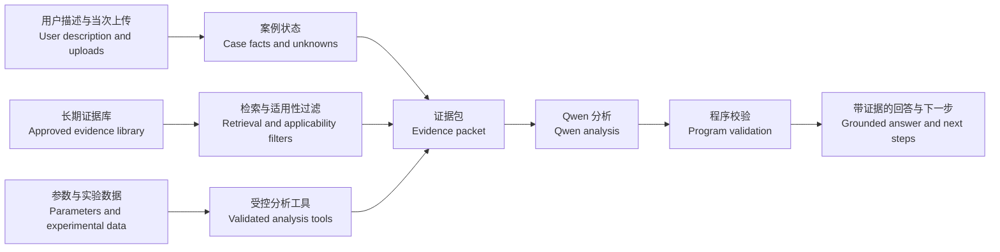

# Battery Safety Copilot 项目协作说明 / Bilingual Team Project Guide

**版本 / Version:** 1.0  
**日期 / Date:** 2026-09-21  
**面向对象 / Audience:** 产品、数据、软件、测试与电池专业组员 / Product, data, software, QA, and battery-domain team members

> 这是一份给团队使用的通俗说明。它帮助大家理解项目目标、当前进度、下一阶段交付和协作边界。具体技术合同与执行限制仍以仓库中的正式文件为准。
>
> This is a plain-language guide for the team. It explains the goal, current status, next milestone, and working boundaries. Formal repository policies and technical contracts remain the source of truth.

## 1. 一句话说明 / The project in one sentence

**中文：** 我们要做一个“有证据、会计算、知道自己不知道什么”的电池安全分析助手。系统读取用户的现场描述、当次上传资料和已获准使用的历史资料，结合产品参数、物理／化学与工程分析工具，给出带来源的状态判断、处理建议、补充核验项和升级路径。

**English:** We are building an evidence-grounded battery safety analysis assistant that can calculate, explain its reasoning, and state what remains unknown. It uses the user's case description, case-time uploads, and approved reference material together with product parameters and engineering tools to provide traceable assessments, suggested next steps, verification needs, and escalation paths.

它不是一个只会聊天的“电池百科”，也不是一个能替代工程负责人、现场程序或应急服务的自动审批系统。

It is more than a battery chatbot, but it does not replace engineering responsibility, site procedures, approvals, or emergency services.

## 2. 为什么要做 / Why we are building it

实际电池问题很少只靠一段文字就能解决。资料可能分散在学校程序、产品手册、实验数据、研究论文、外部实验室实践和用户当次上传的文件中；同一个数值还可能因型号、版本、温度、SOC、测试方法或单位不同而含义不同。

Real battery questions rarely have a reliable answer in one paragraph. Relevant evidence may be spread across institutional procedures, product manuals, experimental data, papers, external laboratory practices, and case-time uploads. The same number can mean different things depending on model, revision, temperature, state of charge, test method, or unit.

本项目要解决的核心问题是：

The project addresses four core problems:

1. **找到正确证据 / Find the right evidence**：找到与具体问题、产品和版本真正相关的内容。  
   Retrieve material that actually matches the question, product, and revision.
2. **保留适用条件 / Preserve conditions**：不能把表头、脚注、例外、单位或否定词切掉。  
   Do not lose headers, footnotes, exceptions, units, or negation during processing.
3. **把文字与计算结合 / Combine evidence with calculation**：需要计算时调用经过验证的工具，而不是让模型猜数值。  
   Use validated tools for calculations instead of asking the language model to invent numerical results.
4. **诚实表达不确定性 / State uncertainty honestly**：明确区分已知、用户报告、测量、推导、假设和未知。  
   Separate known facts, user reports, measurements, derived results, hypotheses, and unknowns.

## 3. 用户给什么，系统回什么 / What goes in and what comes out

### 输入 / Inputs

- 现场或问题描述，例如异常发热、容量下降、储存、运输或实验设计问题。  
  A case or question, such as abnormal heating, capacity loss, storage, transport, or experiment design.
- 当次上传的产品手册、照片、测量记录、CSV 或其他资料。  
  Case-time manuals, photos, measurement logs, CSV files, or other attachments.
- 长期资料库中获准用于相应用途的程序、参考资料、产品信息和实验数据。  
  Approved institutional, technical, product, and experimental sources from the long-term library.
- 必要的对象信息，例如型号、版本、配置、使用环境和测量条件。  
  Required context such as model, revision, configuration, environment, and measurement conditions.

### 输出 / Outputs

- 当前能支持的状态判断，以及证据出处。  
  A supported assessment of the current state, with evidence references.
- 已知、推断、冲突和未知的清单。  
  A clear list of known facts, inferences, conflicts, and unknowns.
- 条件成立时可采用的建议，以及这些建议的适用范围。  
  Conditional recommendations and the boundaries under which they apply.
- 最有价值的补充核验，例如应补哪项测量或确认哪个版本。  
  High-value follow-up checks, such as which measurement or revision to confirm.
- 需要转交负责人、现场流程或应急渠道的情况。  
  Clear escalation when a responsible person, site process, or emergency channel is required.

## 4. 系统如何工作 / How the system works

这张图里，Qwen 是分析和表达层，不是数据真相的唯一来源。资料权限、检索结果、计算结果、运行状态和引用位置由程序记录与校验。

In this flow, Qwen is the analysis and communication layer, not the sole source of truth. Source permissions, retrieval results, calculations, run status, and citations are recorded and checked by software.

## 5. 数据如何分工处理 / How different data types are handled

| 数据类型 / Data type | 处理方式 / Processing approach | 主要用途 / Main use |
|---|---|---|
| 程序、规范、论文、手册 / Procedures, standards, papers, manuals | 按章节、表格和条件切分，保留页码、版本与上下文 / Structure-aware chunks with page, version, and context | 证据检索与引用 / Evidence retrieval and citation |
| 产品规格和规则数值 / Product specifications and rule values | 结构化保存对象、单位、条件、版本和来源 / Store entity, unit, condition, revision, and source | 精确查询与比较 / Exact lookup and comparison |
| CSV、MAT、HDF5、RData 等 / CSV, MAT, HDF5, RData, etc. | 使用对应读取器按需读取，保留缺失值、时间边界和原始字段 / Read on demand with format-specific readers, preserving missing values, time boundaries, and native fields | 计算、曲线与质量检查 / Calculation, plots, and quality checks |
| 图片与扫描页 / Images and scanned pages | 保留原图和定位；OCR 或视觉结果需要质量标记 / Preserve original and location; OCR or vision output carries quality status | 图像证据与待核项 / Visual evidence and review queue |
| 当次上传资料 / Case-time uploads | 放入本次案例空间，默认不自动进入长期知识库 / Keep in the case workspace; do not automatically add to the long-term library | 针对当前问题分析 / Case-specific analysis |

一个重要原则是：**不是所有东西都应该做成 RAG 文本块。** 大型时序数据更适合由读取器和计算工具处理；型号、参数和版本更适合精确数据库查询；文档解释才适合文本检索。

One important rule is that **not everything should become a RAG text chunk**. Large time-series data should be accessed through readers and tools, model and revision fields through exact database queries, and explanatory documents through text retrieval.

## 6. 我们目前做到哪里 / Current status

截至 2026-09-21，数据准备阶段已经完成并经过审计：

As of 21 September 2026, the data preparation stage has been completed and audited:

- 登记了 **300 份原件，约 112 GB**，包括 **70 份文档类对象和 230 份数据类对象**。  
  **300 original objects, about 112 GB**, are registered: **70 document objects and 230 data objects**.
- 各类文档、表格、压缩包、CSV、JSON、MAT、HDF5、RData 和图像已有对应的内容入口、结构合同或受限读取器。  
  Documents, tables, archives, CSV, JSON, MAT, HDF5, RData, and images now have content entries, structural contracts, or bounded readers.
- 文档中共保留 **673 条数值相关记录**。其中上一轮已有 466 条来源断言；另有 207 条完成了新的逐条语义复核。  
  The document layer contains **673 numerical or number-like records**: 466 previously checked source assertions plus 207 records that received a new item-level semantic review.
- 在这 207 条中，**92 条**属于来源限定的参数、实验条件或规则记录，**115 条**属于参考信息、编号、曲线标签、排版信息等其他角色。  
  Of those 207 records, **92** are source-bound parameters, experimental conditions, or rule records, while **115** are references, identifiers, curve labels, formatting information, or other non-parameter roles.
- 207 条的原有语义疑点已经解决，但这不表示它们全部允许进入 RAG，也不表示它们自动适用于任何设备。  
  The original semantic questions for all 207 records are resolved, but this does not mean every record may enter RAG or applies to every device.

### 尚未建成 / Not built yet

- 正式数据库和数据库迁移尚未建立或运行。  
  The target database and migrations have not been built or run.
- 正式 RAG、全文索引和向量索引尚未建立。  
  The target RAG, full-text index, and vector index have not been built.
- 分析工具目前主要是合同与验收输入，尚未形成完整可调用服务。  
  Analysis tools mainly exist as contracts and acceptance inputs, not as a complete callable service.
- 尚未连接服务器上的 Qwen，也未做端到端测试。  
  The server-side Qwen service has not been connected or tested end to end.
- 当前没有微调工作；是否需要微调必须由后续真实测试结果决定。  
  No fine-tuning is underway; the decision must follow evidence from later real tests.

## 7. 下一阶段的共同目标 / Our next shared milestone

下一阶段的终点是：**完成数据处理与数据层实现，达到“下一步即可接入 Qwen 联调”的状态。**

The next milestone is to **finish data processing and the data layer so that Qwen integration testing can begin immediately afterward.**

我们需要交付：

We need to deliver:

1. **准入清单 / Admission manifest**  
   明确每一份资料能否用于解析、索引、模型上下文、评测或其他用途。  
   State whether each source may be parsed, indexed, shown to the model, used for evaluation, or used for another purpose.
2. **统一数据模型 / Unified data model**  
   让来源、版本、证据片段、参数、案例、观测、工具结果和运行记录有稳定 ID，并互相关联。  
   Give stable IDs and links to sources, revisions, evidence spans, parameters, cases, observations, tool results, and runs.
3. **正式导入流程 / Reproducible ingestion pipeline**  
   从明确清单导入，重复运行结果一致；失败对象有原因，不允许整目录盲目导入。  
   Import only from an explicit manifest, behave consistently on repeat runs, and record reasons for failures.
4. **三种数据入口 / Three access paths**  
   文档检索、参数精确查询、实验数据按需读取分别工作，再由统一接口组合。  
   Support document retrieval, exact parameter lookup, and on-demand experimental-data reading through a common interface.
5. **基础分析工具 / Foundational analysis tools**  
   先实现单位换算、受限计算、欧姆损耗、时序检查／积分和规格比较，并返回输入、单位、假设、结果和警告。  
   Start with unit conversion, bounded calculation, ohmic loss, time-series validation/integration, and specification comparison, returning inputs, units, assumptions, results, and warnings.
6. **独立于 Qwen 的测试 / Tests independent of Qwen**  
   证明数据库、检索、权限过滤、引用和工具本身工作正确，再开始模型联调。  
   Prove that the database, retrieval, permission filters, citations, and tools work correctly before model integration.
7. **Qwen 接口合同 / Qwen integration contract**  
   固定模型会收到的证据包、工具定义和返回结构；此阶段不评价 Qwen 回答质量。  
   Define the evidence packet, tool definitions, and output structure for Qwen; model answer quality is outside this milestone.

## 8. 完成标准 / Definition of done before Qwen testing

只有以下演示都能用真实数据复现，我们才进入 Qwen 联调：

We move to Qwen integration only when all of the following can be reproduced with real data:

- 输入一个型号、文档 ID 或参数名称，可以得到正确记录、版本、单位、条件和来源。  
  A model, document ID, or parameter name returns the correct record, revision, unit, condition, and source.
- 输入一个技术问题，可以检索到相关段落或表格，并返回可定位的引用；无结果和无权限是不同状态。  
  A technical query returns relevant passages or tables with resolvable citations; “no result” and “not authorized” are distinct states.
- 指定一个实验数据对象和字段，可以按限制读取真实数据，并保留缺失值、时间重置和质量标记。  
  A named experimental object and field can be read within limits while preserving missing values, time resets, and quality flags.
- 单位换算、基础计算和时序积分通过独立算例；错误单位、非有限值和非法时间轴会被拒绝或明确警告。  
  Unit conversion, core calculations, and time-series integration pass independent fixtures; invalid units, non-finite values, and invalid time axes are rejected or clearly flagged.
- 重复导入不会制造重复记录；版本更新和撤回能够追踪。  
  Re-importing does not create duplicates, and revision changes or withdrawals remain traceable.
- 受限资料不会进入未经允许的索引或模型证据包。  
  Restricted material never enters an unauthorized index or model evidence packet.
- 每次构建都有 manifest、输入哈希、版本、日志、检查结果和失败记录。  
  Every build has a manifest, input hashes, versions, logs, checks, and failure records.

## 9. 建议的团队分工 / Suggested team workstreams

一个人可以承担多个工作流；分工的目的是让接口清楚，不是制造团队墙。

One person may own more than one stream. The purpose is clear ownership, not team silos.

| 工作流 / Workstream | 主要责任 / Main responsibility | 关键交付 / Key deliverable |
|---|---|---|
| 产品与范围 / Product and scope | 定义使用情景、输出形式、完成标准和不做事项 / Define use cases, outputs, acceptance, and exclusions | 验收情景与优先级 / Acceptance scenarios and priorities |
| 来源与准入 / Source and admission | 管理来源身份、版本、用途许可和归属 / Manage source identity, revision, permitted uses, and attribution | 逐项准入 manifest / Item-level admission manifest |
| 文档处理 / Document processing | 提取章节、表格、脚注、条件和定位 / Extract sections, tables, footnotes, conditions, and locators | EvidenceSpan 与质量报告 / Evidence spans and quality report |
| 参数与实验数据 / Parameters and experimental data | 建模参数条件；维护格式读取器和字段合同 / Model parameter conditions; maintain readers and field contracts | 参数记录和数据访问接口 / Parameter records and data access API |
| 数据库与检索 / Database and retrieval | Schema、迁移、精确查询、全文检索和后续向量检索 / Schema, migrations, exact lookup, full-text search, later vector retrieval | 可复现数据层与索引 / Reproducible data layer and indexes |
| 分析工具 / Analysis tools | 实现单位、计算、时序与规格比较，限制输入范围 / Implement units, calculations, time series, and specification comparison with bounded inputs | 可验证工具结果 / Verifiable tool results |
| 平台与接口 / Platform and API | 将数据、检索、工具和未来 Qwen 通过统一接口连接 / Connect data, retrieval, tools, and future Qwen through stable interfaces | Qwen 联调前接口 / Pre-Qwen integration API |
| 测试与审计 / QA and audit | 独立检查真实内容、权限、数据一致性、失败处理和复现性 / Independently check content, permissions, consistency, failure handling, and reproducibility | 测试证据和阻塞清单 / Test evidence and blocker list |

每个工作流都应有一名作者和一名非作者复核者。检查脚本通过只说明脚本检查的范围通过，不自动证明专业结论正确。

Each workstream should have an author and a non-author reviewer. A passing script proves only the scope tested by that script; it does not automatically prove the domain conclusion.

## 10. 大家都要遵守的规则 / Rules for everyone

1. **原件只读 / Originals are read-only.** 派生文件写入项目工作区，不覆盖原件。  
   Derived artifacts go to the project workspace; originals are never overwritten.
2. **不按文件夹批量准入 / No folder-wide admission.** 文件存在、能打开、已解析和允许给模型使用是不同状态。  
   Presence, readability, successful parsing, and permission for model use are separate states.
3. **证据必须可回溯 / Evidence must be traceable.** 每条关键内容保留 source ID、版本和页／节／表格定位。  
   Every important claim retains source ID, revision, and page/section/table location.
4. **条件与单位不能猜 / Never guess conditions or units.** 缺失时记录未知，并关闭依赖该信息的计算。  
   Record missing conditions or units as unknown and disable calculations that depend on them.
5. **外部参考不等于 UNSW 程序 / External references are not UNSW procedures.** 它们可以帮助分析，但必须标明来源和适用边界。  
   External practices can inform analysis but must retain provenance and applicability limits.
6. **模型不签发事实 / The model does not certify facts.** 批准、执行回执、数据库状态和工具结果只能由相应系统产生。  
   Approvals, execution receipts, database state, and tool results must come from the relevant systems.
7. **评测资料隔离 / Evaluation material stays isolated.** 测试题和答案不得进入普通 RAG。  
   Evaluation questions and answers must never enter the ordinary RAG corpus.
8. **先修数据与工具，再讨论微调 / Fix data and tools before discussing fine-tuning.** 只有持续的模型行为问题才可能成为训练候选。  
   Fine-tuning becomes a candidate only for persistent model-behaviour problems after data, retrieval, and tools are correct.

## 11. 已知限制 / Known limitations

- 一份受复制控制的产品测试摘要仍未提取正文。  
  One copy-controlled product test summary remains unparsed.
- 少量源数据没有声明单位、符号方向或校准信息；相关计算必须保持禁用或等待当次资料补全。  
  Some source data do not declare units, sign conventions, or calibration metadata; affected calculations remain disabled until case evidence fills the gap.
- 当前资料覆盖通用分析和背景知识，不声称覆盖所有产品、所有现场或所有现实情景。  
  The current corpus supports general analysis and background knowledge; it does not cover every product, site, or real-world scenario.
- 466 条旧来源断言没有在最近的 207 条修正中重新做全面语义审计。  
  The 466 legacy source assertions were not comprehensively re-audited during the latest 207-record correction.
- 当前服务器、传输范围和 Qwen 服务信息尚未配置；服务器上的正式数据层验收尚未执行。  
  Server details, transfer scope, and Qwen service configuration are not yet set; formal server-side data-layer acceptance has not run.

这些限制不会阻止我们建设第一版，但必须进入任务清单和验收报告，不能隐藏。

These limits do not prevent a first version, but they must remain visible in the backlog and acceptance report.

## 12. 新成员从哪里开始 / Where a new team member should start

建议按以下顺序阅读：

Read in this order:

1. 本文件：了解项目和团队共同语言。  
   This guide: understand the project and shared vocabulary.
2. [`README.md`](../README.md)：查看项目当前真实状态和入口。  
   [`README.md`](../README.md): current project status and entry points.
3. [`IMPLEMENTATION_PLAN.md`](../IMPLEMENTATION_PLAN.md)：了解完整产品与实施设计。  
   [`IMPLEMENTATION_PLAN.md`](../IMPLEMENTATION_PLAN.md): full product and implementation design.
4. [`RAG_AND_DATA.md`](RAG_AND_DATA.md)：了解数据、权限、切片和检索规则。  
   [`RAG_AND_DATA.md`](RAG_AND_DATA.md): data, permission, chunking, and retrieval rules.
5. [`CONTRACTS_AND_API.md`](CONTRACTS_AND_API.md)：了解数据库对象和接口边界。  
   [`CONTRACTS_AND_API.md`](CONTRACTS_AND_API.md): database objects and API boundaries.
6. [`LOCAL_SERVER_EXECUTION_BOUNDARY.md`](LOCAL_SERVER_EXECUTION_BOUNDARY.md)：开始任何执行工作前确认环境边界。  
   [`LOCAL_SERVER_EXECUTION_BOUNDARY.md`](LOCAL_SERVER_EXECUTION_BOUNDARY.md): check execution boundaries before running anything.
7. 数据准备的[使用说明](../data_preparation/CR-DATA-READY-001/20260920T012405_AEST/HANDOFF_GUIDE.md)和[最新 207 条修正](../data_preparation/CR-DATA-CANDIDATE-001/20260920T045258_AEST/README.md)。  
   The data-preparation [handoff guide](../data_preparation/CR-DATA-READY-001/20260920T012405_AEST/HANDOFF_GUIDE.md) and [latest 207-record correction](../data_preparation/CR-DATA-CANDIDATE-001/20260920T045258_AEST/README.md).

## 13. 常用词汇 / Shared vocabulary

| 词语 / Term | 简单解释 / Plain meaning |
|---|---|
| RAG | 先从资料库找证据，再让模型依据证据回答 / Retrieve evidence first, then let the model answer from it |
| SourceRecord | 一份来源的身份卡：是谁、哪个版本、在哪里、能怎么用 / Identity card for a source: origin, revision, location, and allowed uses |
| EvidenceSpan | 可引用的一小段正文、表格或图像区域，带原文定位 / A citable passage, table region, or image region with a source locator |
| Manifest | 本次导入或传输的明确清单，包含 ID、哈希、用途和版本 / An explicit import or transfer list with IDs, hashes, uses, and versions |
| Fact / 事实 | 来源或观测直接支持的内容 / Content directly supported by a source or observation |
| Derived / 推导 | 由明确输入和方法计算得到的结果 / A result calculated from explicit inputs and a named method |
| Hypothesis / 假设 | 尚待证据支持或排除的解释 / An explanation still awaiting support or rejection |
| Applicability / 适用性 | 一条资料是否适合当前产品、版本、配置和现场 / Whether evidence fits the current product, revision, configuration, and site |
| Provenance / 血缘 | 一个结果从哪些原件、转换和代码版本得到 / The originals, transformations, and code versions behind a result |
| Qwen integration | 把已验证的数据、检索和工具以受控接口提供给 Qwen / Expose validated data, retrieval, and tools to Qwen through controlled interfaces |

## 14. 团队启动会建议 / Suggested kickoff agenda

第一次团队会议建议完成五件事：

The first team meeting should complete five things:

1. 用一个真实但非紧急的案例，确认大家对输入、证据、计算和输出的理解一致。  
   Walk through one real but non-emergency case to align on inputs, evidence, calculations, and outputs.
2. 确认下一阶段以“Qwen 联调前数据层完成”为共同里程碑。  
   Confirm “data layer ready for Qwen integration” as the shared milestone.
3. 为第 9 节每个工作流指定作者和复核者。  
   Assign an author and reviewer to each workstream in Section 9.
4. 冻结第一批最小演示资料和验收查询，不以整批 112 GB 作为第一次集成目标。  
   Freeze the first minimal demonstration set and acceptance queries instead of treating all 112 GB as the first integration target.
5. 确认服务器环境、允许传输的 manifest、日志位置和 Qwen 接口信息的负责人。  
   Assign owners for server configuration, approved transfer manifests, log locations, and Qwen interface details.

团队做出的每个决定都要回答三个问题：**依据是什么？适用到哪里？还不知道什么？**

Every team decision should answer three questions: **What supports it? Where does it apply? What remains unknown?**
