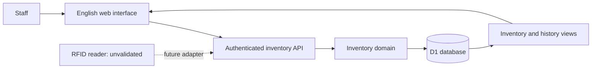

# Architecture and design decisions

## System boundary

The browser presents the staff review workflow. The authenticated API validates inputs, resolves identity server-side and performs prepared SQL against Cloudflare D1. Drizzle defines a versioned schema; runtime domain operations use the D1 API directly so their transactional boundary is explicit.

## Current module boundaries

The application remains one deployable system and one D1 database. The current organization separates presentation, browser lifecycle coordination, business operations and storage concerns without replacing the transaction model.

| Area | Entry points and responsibility |
| --- | --- |
| Application composition | `app/inventory-app.tsx` connects workspaces, reviewed dialogs and deliberate operation entry points. |
| Navigation and presentation | `components/application/` owns the sidebar/top bar, workspace heading and recovery notices. |
| Client lifecycle | `hooks/use-inventory-data.ts` owns authoritative snapshots, context changes and stale-response rejection; polling cancels in-flight work when its context changes. `use-message-count.ts` retains global own unread counts independently of inbox filters. |
| Workflow recovery | `lib/client/workflow-recovery.ts` reads existing account/dataset-bound recovery records without modifying payloads; one priority rule gates ordinary navigation and browser-tool movement entry. `use-workflow-recovery.ts` connects this model to browser events. |
| Shared contracts | `lib/client/inventory-contracts.ts` defines operation names and form drafts without depending on UI components. |
| Business UI | Inventory table, directory management and activity history have separate components. Task requests, endpoint loading, list, editor, cycle detail and shared notices have independent modules. Compatibility exports preserve existing callers during this migration. |
| Inventory facade | `lib/store.ts` preserves the existing `InventoryStore` API and composes focused services. |
| Inventory services | `lib/server/inventory/` separates queries, directories, registration, movements, lifecycle, maintenance, imports and teaching-group resolution. Small database/session/transaction helpers carry the scoped D1 connection, authenticated actor, receipts and audit boundary. Services never call back into the facade. |
| Provisioning | The dedicated provisioning module supplies missing reference directories. Intake invokes it directly instead of retrieving a full inventory snapshot. Existing snapshot provisioning and request-driven task generation remain explicit release behavior. |
| Visual system | `app/globals.css` imports `styles/theme.css`, `base.css`, `shell.css`, `components.css`, `inventory.css` and `workflows.css`; colors and interaction primitives are defined once. |

The module reorganization preserves existing schema migrations, shared/private data boundaries, exact loan/tag/version guards, terminal rejection receipts and the atomic D1 batch containing a business operation and its audit evidence. Recoverable task-record removal is a separate additive schema change described below. Full snapshots and complete-history exports remain the existing small-inventory implementation; server-side pagination is a separate future change that requires scale measurements.

The test runner discovers root `*.test.mjs` suites and recursively transpiles the library graph with its relative paths intact. D1 suites use separate Miniflare databases and bounded suite concurrency. Component-handler tests still do not claim real DOM or visual coverage; browser review is recorded separately in the validation log.

Production API checks copy the built Worker and assets into an isolated run directory, apply the complete migration journal to a fresh local D1 database and create temporary native accounts. Each run owns its ports, process tree and state. This keeps checks independent of the normal preview, its credentials and concurrent builds. Rejected JSON-request bodies are discarded without buffering, within byte and time limits, before returning the original origin/content-type rejection; this prevents an unread small request from disrupting the local Worker transport's next request.

## Data model

| Table | Responsibility |
| --- | --- |
| people | Explicit native staff-account directory projections |
| buildings | Reference campus building codes and names; current write support is J18 |
| rooms | Number/name, parent building, placeholder and selectable flags |
| batteries | Asset identity, tag, specifications, owner and storage building with optional room |
| loans | Checkout, original holder snapshot/account ID, return and correction state |
| observations | Room, observation time, receipt time and source |
| charges | Historical completion time, duration in minutes and recorder; legacy percentage retained |
| audit_events | Who did what, when, and relevant before/after details |
| operations | Idempotency result and transaction guard |
| workspaces | One-time demo initialization marker |
| shared_inventories | Canonical scope for each shared working/demo dataset |
| staff_accounts | Login identity, role, access, profile, password hash and versions |
| staff_sessions | Hashed session tokens, account authorization version and expiry |
| staff_account_events | Immutable account-management and profile/password audit |
| sign_in_attempts | Failed sign-in window counters |
| task_plans | Shared versioned periodic configuration, basis, scope, recurrence, reminder preferences and recoverable removal timestamp |
| task_plan_assignees | Explicit native account assignments for each plan |
| task_plan_batteries | Explicit registered-battery membership for selected/group targets |
| task_cycles | Recorded requirements/target snapshot and due date, versioned reminder state and completion evidence |
| task_messages | Recipient-specific persistent reminder content, creation/read evidence, version and recoverable removal timestamp |
| teaching_groups | Account-private, inventory-specific saved battery selections with versions and archive state |
| teaching_group_operations | Immutable private request receipts or final rejections and commit guards |
| teaching_group_events | Private attributed before/after evidence for creating, editing and removing shortcuts |

All business queries are scoped to the canonical inventory scope selected by dataset. Every active account resolves to the same working register and the same separate demonstration register. The server attaches the individual authenticated actor to writes. Staff directory rows project native accounts using explicit account IDs, unique per inventory; names never match identities. Missing reference buildings, placeholder rooms and account projections are inserted idempotently. Once complete, snapshot reads do not issue provisioning write batches. Current account names are joined for display without rewriting stored people versions or transaction snapshots.

Staff choices display the saved name with the account username, or the full stable identity ID if the username is unavailable. Owner selections retain directory IDs and holder/task selections retain native account IDs. Directory downloads, including the related People table in detailed battery exports, use the same current native-name projection as the visible directory; historical borrower and actor snapshots retain their original names.

Personal shortcuts narrow this shared register: My batteries compares ownerAccountId with the authenticated account; My batteries in use compares the active holder's account ID. They are presentation/query scopes, not private inventories or permissions. Everyone can return to the complete inventory. Teaching groups are private preferences over shared asset IDs, scoped separately to the native account and dataset.

My activity uses the same inventory audit log and filters its stored actor_id against the authenticated account. The complete-history endpoint accepts activityScope=all or mine; the server resolves the personal ID from the session. Activity exports apply the same scope before search and retain full event details. Neither personal view uses the snapshot's 200-event cap as its history source. Actor names remain historical display evidence rather than identity keys. Account-management and sign-in logs remain separate.

Migration 0004 adds accounts and shared scope mapping without rebuilding existing business tables. On first use, a dataset with exactly one legacy inventory adopts its existing scope; keys, actor history and references stay intact. A fresh dataset receives a shared scope. Multiple legacy scopes return `legacy_inventory_review` and preserve all records until an explicit collision review and migration. This release does not claim to merge arbitrary private registers.

## Periodic tasks and Messages

`lib/task-schedule.ts` defines the three categories, prepared templates, active validation, original-anchor calendar arithmetic and explicit Sydney reminder conversion. `lib/task-plans.ts` resolves shared dataset scope and authenticated identity, validates actual model/room/asset targets and uses D1 transaction guards. `/api/task-plans` supplies shared records, administrator configuration/removal/restoration and assigned completion; `/api/messages` supplies only the authenticated recipient's message/read/visibility state. Neither client-provided actor IDs nor display names determine identity.

Migration `0008_periodic_tasks_messages.sql` adds the five task tables, foreign keys, same-scope/identity/evidence guards and unique indexes without rebuilding earlier account or business tables. A partial unique index permits one open cycle per plan. Message occurrence uniqueness deduplicates a cycle/recipient reminder. Existing inventory guards, actor keys, account authorization versions and operations/audit tables remain in use; source release 0.3.0 is unchanged.

Additive migration `0009_optional_task_completion_notes.sql` replaces only the cycle update trigger to permit absent completion notes and enforce their maximum length. Completion time and operator remain required, recorded cycles remain immutable and all existing identity/version/history guards remain in place. Earlier migration files are unchanged.

Additive migration `0015_recoverable_task_removal.sql` adds nullable `removed_at` fields to plans and messages, a message version and a recipient/current-message index. Removal does not delete either record or rewrite plan state, original message content/read history, recorded cycles or completion evidence. Database triggers reject cycle insertion/update and message generation for removed plans and require message versions to advance while preserving existing immutable evidence. Earlier migration files remain unchanged.

All staff may view/search/download shared plans and recorded cycles. Only administrators configure them. Completion carries the loaded cycle ID/version and optional notes; omitted, empty or whitespace-only notes are stored as null. Nonempty notes are trimmed and limited to 2,000 characters. Completion time and actor are always retained. The server checks active authorization and current assignment, allowing administrators all cycles. Create/update/complete requests use stable request IDs for unchanged retries. Atomic guards reject concurrent plan, cycle, assignment, target or authorization changes; a conflicting form retains its input and requires explicit review before replacing its loaded version. Mark read changes only the authenticated recipient's read timestamp.

`TaskPlanStore.changePlanVisibility` requires administrator authority; `changeMessageVisibility` resolves only the authenticated recipient's record. Remove/restore carries its ID, loaded version and request ID. The state change, actor-attributed event and matching receipt commit in one guarded D1 batch. Replays return the original result; authorized final rejections reserve the operation key so a delayed original write cannot later succeed. `lib/client/task-record-action.ts` saves the exact payload in account/dataset/resource-specific session storage before sending and verifies the returned record/version/action, request, account and dataset before the interface treats it as saved. Reopening the panel in the same intact tab offers explicit recovery, including when the record has already left the current list. Only a matching receipt or a reserved final rejection clears the request; ordinary conflicts and uncertain results retain it. Storage failure blocks the write. Unmounting suppresses late callbacks into a different view. Closed tabs, cleared storage and other devices remain outside this recovery guarantee.

Removed plans are excluded from generation and reject edits/completion, including completion entered through an existing message. Restore clears the removal timestamp while retaining the original draft/active/paused state, configuration, assignments and existing open cycle. It neither replaces that cycle nor resets its recorded due date. Later authenticated evaluation resumes only the generation allowed by the retained state and existing recurrence rules. Recipient message removal does not remove the plan, change completion or affect another inbox. Existing occurrence uniqueness prevents generating a replacement copy of a removed reminder.

New-plan submission captures the validated configuration and request ID in account/inventory-specific session storage before sending. An uncertain result locks editing and dismissal; returning to Recurring tasks in the same intact tab recovers the exact submission. A verified actor/inventory/request receipt clears the capture. An explicit review may replace a definitively rejected request, but ordinary HTTP errors cannot clear prior uncertainty. The server rechecks matching receipts after conflicts and reserves the same operation key with `task_plan_create_rejected` when rejecting finally. A paused original request cannot later create another plan after that final outcome. Closed tabs, cleared storage and other devices are outside this recovery guarantee.

Templates cover weekly storage-area review, teaching-period reconciliation at confirmed explicit dates and applicable storage maintenance provisionally every six calendar months. The form confirms basis, required work, scope, actual targets, dates, explicit reminder time and assignments before activation. Live area tasks reject placeholders. Model/group asset membership and room labels are saved in the cycle target snapshot; later changes do not silently expand or rewrite that open cycle. Plan edits preserve cycle content and due date while updating its reminder preferences and current routing. Historical completions and Messages are retained.

Calendar recurrence derives each occurrence from the original date anchor, preserving month-end behavior. Completion-based recurrence uses actual completion; explicit dates remain configured dates. After completion, calendar/explicit rules advance beyond the previous due date and actual completion. Skipped planning periods are recorded separately and do not create completion evidence. Reminder advance uses calendar days independently of due date. A Sydney wall time resolves to UTC only when exactly one instant exists; ambiguous/nonexistent times remain visibly unavailable.

Authenticated inventory/task/Message requests evaluate active plans and due reminders. This may create the next outstanding cycle and one message per current active recipient when its valid reminder instant has been reached. Generation rechecks state, assignment and version atomically. Invalid later targets or disabled assignments produce visible generation issues. Former assignees keep old inbox history but receive no future routing; completed or paused tasks and removed plans generate no new reminders. There is no scheduled worker, continuous background guarantee or email transport. Saved email preferences do not send an email.

Both task endpoints accept `visibility=current|removed|all`, defaulting to current. The shared plans view/download applies visibility and `taskPlanMatchesQuery` before selecting associated complete cycle history. Personal Messages visibility/task-state/read-state/search and JSON downloads use the same authenticated server scope, without the inventory snapshot's 200-event cap. To do excludes cycles whose plan is removed. Unread counts include only the recipient's nonremoved messages in the selected inventory and remain independent of other filters; restoring an unread message returns it to that count. Downloads include scope/count/filter metadata, omit private credentials and remain separate from battery-detail sections. Task/Message views refresh every fifteen seconds while visible and idle, pause around review dialogs and reject late responses from another account/dataset/context.

The Messages interface renders one responsive card per record so completion, read and remove/restore actions remain beside or below its content. Task state and recipient read state are distinct badges. `TaskCycleDialog` shows a short deadline/assignment summary, optional notes and explicit completion confirmation, with recorded requirements in an initially collapsed details element. Its bounded flex container keeps the footer outside the scrolling body. Completed tasks offer View completion; removed plans and unassigned viewers receive an explicit reason instead of an unexplained missing completion control. Plan actions sit with their title, and the prepared-template library starts collapsed.

The existing six-module visual system keeps the yellow-and-ink palette. Operational text/table cells are 14px, hints 13px and compact labels at least 12px. The supporting token is `#52524d`; sidebar status text consumes that color at full opacity. These are presentation changes, with actual color calculations and responsive rules documented in the [design system](design-system.md). Browser and transaction verification outcomes belong in the validation record.

## Loan state

The database has a partial unique index allowing only one active loan for each battery. Confirmed checkout creates a loan for the authenticated staff member. The API rejects borrower/account/name substitutes, including administrator proxy requests. A missing linked directory row is created inside the same guarded checkout transaction with a deterministic account-derived ID. The loan stores the account ID and current saved account name; its original responsibility and checkout evidence cannot be rewritten. Confirmed return closes the exact reviewed loan and attributes receipt to the signed-in operator. Return review may contain batteries from different holders and original legacy borrowers.

A batch starts with an operations row whose CHECK constraint succeeds only if all expected loan states and authenticated permissions still hold. A return carries exact battery/loan ID pairs, not just battery IDs. Bound JSON sets avoid D1's per-statement parameter ceiling for the supported 100-battery batch without splitting its transaction. D1 batch applies the guard and every movement atomically. A conflict rolls back the complete batch. Request identifiers include the reviewed scope/state and permit safe retries after an interrupted response; reusing an identifier for a different action is rejected.

Ordinary checkout and return review capture the exact payload and reviewed rows in account/inventory/kind-specific session storage before submitting. An uncertain result locks changes and dismissal until the original request is retried and resolved. Recovery in the same browser tab resumes the captured request, never a later loan. A definite rejection requires explicit latest-state review before replacing or discarding that request. Saved receipts must match the request ID, movement, complete battery set, count and timestamp; checkout also requires the authenticated holder account. Neither a network error nor refreshed current state establishes success. Browser tools cannot replace an open workflow or bypass an unfinished movement or scan session.

Concurrent executions resolve against the same immutable request key. After a movement validation or transaction conflict, the server checks again for a matching committed receipt. If the authorized request has no receipt, a final rejection reserves that same key with internal operation kind `movement_rejected`, without changing a loan, observation or business audit event. Success and rejection cannot both win; even reopening the same loan cannot allow a previously rejected in-flight request to commit later. Matching retries return the saved success or `movement_rejected_final`; a different actor or payload cannot adopt either outcome. After a lost response, clients retain uncertainty on ordinary HTTP errors until a matching receipt or this durable final-rejection code arrives. Storage or authorization failures that prevent reservation do not claim a final outcome. An explicitly reviewed replacement uses a new request ID.

The scan station reuses this movement boundary. `scan_lookup` resolves exact registered tag strings within the authenticated shared inventory and does not mutate loans or register unknown batteries. Its manual/simulated sources remain available for tag input and prior demonstrations. The right-side Manual selection panel instead captures displayed battery records directly and records source `selection` in both inventories, without inventing a tag read. A station movement includes its session ID and reviewed battery/tag/version bindings, which cover the entire batch exactly. Only selection may capture a null tag. The transaction rechecks exact bindings using null-safe tag equality as well as loan state; adding/removing a tag or changing metadata cannot silently alter the reviewed action. No hardware transport is enabled.

Continuous mode deliberately entered by staff commits each eligible input; Batch mode requires one reviewed-list confirmation. The page stays open after either success. Scan lookup and passive room observations cannot commit a loan on their own. An interrupted attempt retains its original request ID, source, bindings, exact loans and optional placement until a definitive response. Sidebar navigation, dataset switching and sign-out are unavailable while the station is open; exit is explicit.

The demonstration picker offers only tagged in-store batteries for checkout and tagged on-loan batteries for return. A verified movement clears only its successful selections; lookup failures, batch reads awaiting confirmation and uncertain or rejected writes retain their inputs. The picker suppresses the consumed pre-commit snapshot if refresh fails, without inventing a loan or rewriting inventory. A fresh authoritative snapshot can offer a later borrowing round at the same metadata version. Manual tag input and server binding/state guards remain authoritative.

An unregistered tag can open a registration form with that exact identifier prefilled. Registration alone does not process a movement or resolve the earlier read; staff deliberately read the tag again. Only a successful lookup of the matching registered tag resolves its earlier unknown-tag issues. Other tag, loan-state and uncertain-write problems remain pending. Completed actions retain separate request receipts, allowing a later loan of the same battery to be returned in the same station while suppressing repeats of the reviewed loan action. A battery that has been returned may also be checked out again without restarting the checkout station.

A station return can include an optional reviewed room/version. Its room and parent-building versions are guarded in the same atomic batch as the loan close, observation inserts and audit events. The evidence records server confirmation time, source and room/building label snapshots. Only a return with input source `simulated` records Simulated return confirmation; manual tag input and manual selection record Staff return confirmation in either inventory. Demonstration room labels retain their placeholder status, and live placement requires a selectable non-placeholder J18 room. Unspecified placement appends no location observation. Registered storage remains unchanged. These changes use existing operations, observations and audit tables and require no migration.

Reviewing a rejected placement does not change its captured room or retry payload. After explicit discard, the station uses the reviewed room directory and requires a new deliberate room choice, including an explicit Room unspecified choice when no placement is intended. Earlier receipts retain their placement evidence. Same-tab recovery retains this confirmation requirement; if its reviewed directory is unavailable after remount, staff reload current return rooms before choosing again. Unavailable and live placeholder rooms remain excluded.

Only the most recent loan is eligible for correction. A mistaken active checkout is marked corrected; a mistaken return is reopened. The request freezes the intended correction action and reviewed return timestamp, and the commit guard checks both. A concurrent return cannot turn a void-checkout draft into a reopen-return action. The audit records the reason and pre-correction values. Existing transactions are not deleted.

Migration 0006 adds nullable people/loan account references and immutable association/evidence triggers without rebuilding tables or backfilling old borrowers. Old names, timestamps, actors, returns and corrected loans remain unchanged. Account disablement does not remove historical responsibility; other active staff can receive its return.

## Location and charging

Loan state is independent of observations. Latest location sorts by observation time, then receipt time and insertion order. Delayed older evidence cannot replace newer evidence. Observation time and source always travel with the room.

Storage uses a building plus an optional room. J18 Willis Annexe, E10 Hilmer Building and G17 Electrical Engineering Building are reference configuration, never evidence of physical presence. Only J18 is enabled for new battery and room registration/import. Demo room and Demo workspace are explicitly marked placeholders in both inventories; unknown assigned rooms can still be SQL NULL. Other building choices are disabled and room information is Not available. Rooms have stable IDs and numbers unique within their building. A selected room must be selectable and belong to the supported building and inventory. Renaming alone preserves its placeholder flag; verification is an explicit administrator action.

Migration 0007 adds constrained boolean room flags without rebuilding tables. It preserves existing identities, versions and evidence and accepts explicit placeholder labels in the existing observation-integrity guard. The local preview uses fresh disposable test business state; no compatibility-owner mapping field or legacy-borrower UI category was introduced.

New observations store the room number/name and building code/name when evidence is received. Both room and building versions, observation and audit event are checked and committed together. Later room or building edits do not change those stored labels. For a delayed observation, this snapshot does not reconstruct the room's name at an earlier observation time.

Older observations without saved labels retain their room ID and display that the original label is unavailable. The migration does not guess historical names. Location evidence is appended; existing observations cannot be rewritten.

New charge records pair a positive finite duration in minutes with completion time. Latest duration and time come from the same row, ordered by completion rather than receipt time. The software accepts durations up to 525,600 minutes as a data validation ceiling, not as a battery safety recommendation. Original percentages remain in legacy database/history records; they are no longer accepted in new charge submissions or displayed as charging information. Existing unknown durations remain NULL. Charge evidence is appended and cannot be rewritten. Sydney date entry is converted to UTC and rejects skipped/ambiguous daylight-saving times.

## Metadata and relationship integrity

Buildings, rooms and batteries have a version number. Their edits must submit the version loaded by the form. A stale edit returns HTTP 409 with `record_conflict`; it changes neither the record nor its audit history. A transaction guard verifies the version again when the write commits, so a change between validation and persistence is also rejected. Staff directory projections are read-only; staff identity and profile edits use the separate account-management workflow.

New CSV battery imports save one registration event per battery and an identified batch summary in the same guarded transaction as their records. Each registration links to its import request and retains the initial normalized values and native operator. Battery details and exports include only batch summaries linked through that battery's registration evidence. Unlinked older global import summaries remain in shared Activity; the system does not guess which batteries they registered.

The form keeps the staff member's input after a conflict. Loading the latest record retains other users' changes to untouched fields and keeps the staff member's edited fields. If both changed the same field, the form shows the saved value alongside the current proposal. The staff member reviews and explicitly saves the result.

Versioned database triggers enforce record identity, version increments and same-inventory relationships even for direct SQL writes. A responsible battery owner must be a staff record and cannot be demoted while responsible for a battery. Battery storage rooms, loan borrowers, observations and charging records must belong to the same inventory as the battery. Future table rebuilds must recreate these trigger constraints.

Existing metadata and history identifiers cannot be inserted again through SQLite replacement or upsert statements. This prevents bypassing update guards and prevents a duplicate RFID identifier from deleting another battery. Metadata changes use ordinary versioned updates; observation evidence uses new identifiers.

Migrations 0001 and 0002 add integrity guards without rebuilding business tables. Migration 0003 adds buildings, room hierarchy and charging duration, and rebuilds batteries to allow an unknown room. It runs in one D1 transaction with deferred foreign-key validation; existing child references use NO ACTION, identities/versions and rows are copied, and every affected trigger/index is recreated before validation resumes. It does not disable foreign keys or edit earlier migrations. Migration tests retain old loans, observations, charging percentages and audit events and check for foreign-key violations. See [Cloudflare D1's foreign-key guidance](https://developers.cloudflare.com/d1/sql-api/foreign-keys/) and [SQLite's table-change procedure](https://www.sqlite.org/lang_altertable.html). Constraint failures use SQLite's [trigger error mechanism](https://www.sqlite.org/lang_createtrigger.html).

## Usability decisions

- The checkout holder is the signed-in staff member and needs no entry.
- Selected batteries appear first; optional search/manual tag lookup adds already registered batteries.
- The independent return shortcut starts with the current staff member's loans and can show all holders; explicit row selections are retained.
- Unknown or duplicate tag identifiers produce visible messages before confirmation.
- Searchable registered records reduce typing; CSV import supports initial setup.
- Invalid input remains in the form for correction.
- If a write succeeds but the following refresh fails, the message says the write succeeded and requests a refresh.
- Base UI combobox popups render inside the form's container to cooperate with Radix dialog focus/dismissal.
- Browser tools can read inventory or stage a review. They cannot commit a loan; a staff member confirms through the visible interface.

## Access and operational limits

Native application accounts are required for this release. Administrators create accounts; public sign-up and implicit first-visitor administration are absent. The initial administrator requires an installation setup secret and a newly chosen password. A local launcher generates an ignored development setup key; no production password or key is embedded in source.

Passwords use independently salted PBKDF2-SHA-256 with 600,000 iterations. The installed local Worker runtime was checked with this setting; any future deployment needs runtime and security review. The choice follows [OWASP password-storage guidance](https://cheatsheetseries.owasp.org/cheatsheets/Password_Storage_Cheat_Sheet.html). Only hashed random session tokens are stored in D1. Cookies use HttpOnly, SameSite=Strict, an eight-hour lifetime and Secure on HTTPS. Native session checks reject expired, disabled or superseded authorization versions on every API request. Password changes/reset, disabling and role changes revoke previous sessions. Failed sign-ins are throttled per username after ten failures in a fifteen-minute window; this is not a claim of comprehensive attack protection.

Server role checks distinguish registration from editing. Staff may read/export all business records, create batteries and confirm checkout/return. Administrator maintenance includes saved metadata, buildings/rooms, charge/demo-observation evidence, reasoned history corrections and account management. The staff directory is read-only; editable standalone people registration/import is disabled. New battery owners must be active native staff accounts, rechecked at commit alongside the actor's active state, authorization version and role. Own-profile operations cannot change role/access or another person's account. Account lists/audit are administrator-only. Permission checks are independent of hidden buttons.

Account edits use an expected version and atomic audit guard. Direct database triggers prevent deletion/replacement of account identities, account-audit rewrites and removal of the last active administrator. Disabled identities remain for attribution. Inventory history uses stable actor IDs and the name recorded at the time; later profile edits do not rewrite events.

API writes validate origin, JSON content and request size. SQL parameters are bound. Downloads require native sessions and return no-store HTTP attachments; credentials and session rows are not exported. The old hosting contract remains isolated in `lib/platform/auth-contract.ts`, preserving external protocol identifiers. Its headers and old mock cookie no longer grant access, and mock authentication is disabled in local Vite configuration.

## Shared refresh and exports

Shared and personal battery tables use the same row selection handler. Clicking a row's noninteractive area toggles that battery through a functional state update; checkbox changes set its explicit state through the same handler. Interactive descendant controls are excluded from the row click, preserving detail buttons and preventing duplicate toggles from checkbox events. Loading blocks selection, deliberate text selection remains available, and native table/checkbox keyboard semantics are retained. This affects browser selection state only; filters, export scope and confirmed movements retain their existing boundaries.

The inventory Filter panel keeps search visible and groups its fields under native disclosure controls: Battery details, Location, People, Age & activity, Teaching groups and Sort order. All categories start collapsed and may be opened independently. Disclosure state does not modify shared filter values; closing/reopening the panel remounts categories collapsed while retaining criteria in the parent view. Category badges count logical conditions from the applied-filter chips above results, excluding separate search/status criteria. A range counts once even when its mode and both bounds are set. Clear filters, personal scope and selected battery IDs remain controlled by the parent view. There is no observation-date criterion in this filter schema; latest observation time is available as an ordering field.

Snapshots read their related view tables in one D1 batch. Each server-generated export similarly reads inventory, complete evidence tables and directories together. A single Filter panel and the three status tabs use one shared schema/query for counts, pages and exports, with explicit unknown handling. Applied filters exposes active conditions above results. Chemistry/model values come from saved records; current-holder filters use account IDs. Timestamp ranges compare Sydney calendar dates; manufacture age uses one captured calculation date shared by filtering and exported age fields. Summary and detail scopes cover captured selected IDs, all matching batteries or the requested page; details also cover one ID. Nine section checkboxes determine included fields and history tables. All relevant stored history columns are retained. Credentials and sessions are excluded.

For personal exports, the viewer account comes from authenticated server context. Client-supplied viewer IDs cannot alter it. Explicit selected IDs and single-battery requests ignore ordinary filters and pagination but must remain in the current fixed personal base. A return or owner reassignment that moves any selected battery outside that base produces HTTP 409 for the whole export; an unavailable single battery produces HTTP 404. The UI retains its draft and selection with a visible error. Directory-list exports include native staff projections; detailed related-directory evidence remains complete for the requested records. The staff directory displays its Owner ID (CSV), account username and active state; only an active owner's directory ID is suitable for new battery imports.

Detail screens show at most 200 recent entries per section for readability. Export reads have no such limit. Excel contains separate tables/worksheets and metadata; JSON preserves table structure. CSV supports flat reports and is rejected for detailed requests that would otherwise lose tables. CSV formula-like text is neutralized. Long Excel text is losslessly split into numbered parts in a Complete text worksheet. The published ExcelJS browser bundle encodes complete XML strings as UTF-8 bytes before ZIP chunking, preserving Unicode surrogate pairs across archive boundaries without global patches. Worksheet row-limit overflow produces an explicit error and a JSON alternative.

Downloads are generated on the server and delivered as HTTP attachments. The interface submits one POST with the requested format, validates the actual response and reads its complete file body before triggering browser saving. Failure preserves the dialog, chosen scope and sections with a visible error. The older GET attachment and POST JSON-document routes remain available. Screen counts can differ from the file if another staff member changes inventory meanwhile. Export metadata records the generated scope, counts, selected sections and UTC time; it does not claim a frozen snapshot of the earlier screen.

Periodic task and Message JSON downloads use the same attachment reader. They validate HTTP status, MIME type, attachment disposition, complete JSON, inventory/scope and exported counts before initiating a browser download. Errors remain visible without resetting the search or task/read filters. Successfully reading an attachment does not establish that the operating system finished saving it.

Battery details read the current battery and its bounded histories together in one D1 batch. Refresh details updates metadata, status, holder and evidence from that response; the asset editor receives the refreshed record and its version.

The visible idle interface polls every ten seconds and on focus. Polling pauses around inventory draft dialogs, and changed data cannot silently discard selection or advance a form's loaded version. Stale requests cannot replace a newer loaded dataset. Personal profile conflicts preserve edited fields for a reviewed reload. This is eventual interface refresh; server state and conflict checks apply when each request commits.

## Reusable battery model suggestions

`/api/battery-models` authenticates native staff and returns saved templates, consistent registered-model suggestions and the pinned research catalog. The reference JSON is bundled only on the server; it is not queried through the D1 asset database or loaded from a worker filesystem. The published research hash and the separately specified JavaScript JSON-value hash retain their different meanings. No research or physical-stock record is added by loading suggestions.

Model templates use their own same-inventory table, separate from individual batteries. Staff create templates; administrators edit them with expected versions. Native account, duplicate identity and version guards commit together with operator-attributed audit events. Create/update requests retain stable identifiers and immutable receipts. The browser preserves uncertain requests in account/dataset-scoped session storage and never retries automatically. Template updates retain prior audit/receipt evidence and do not cascade into physical assets.

Registration resolves a confirmed choice by origin, exact ID and content hash. It records authoritative model/source evidence and per-asset overrides in the same transaction as the individual battery. Existing source batteries also have exact version/specification and model-group guards; a later source change rejects the reviewed suggestion. Asset identity, custody, storage and dates remain independently entered. Model lookup is optional, so unavailable references never block manual registration. Matching and applying a suggestion does not verify physical condition, ownership or safety.

## Reviewed first-time intake

`lib/intake-session.ts` defines the reviewed common configuration, individual simulated-tag request, same-account/dataset recovery and verified receipt. `lib/intake-draft.ts` adds a bounded, validated session draft. `IntakeStation` reuses model assistance for the common details and stages scans without registering assets. Staff may edit or remove drafts, then explicitly confirm all or selected entries. Each chosen entry is registered independently; verified successes leave the queue, while rejected and unselected drafts remain. An uncertain response freezes its exact request and stops further confirmations. Intake is reached through **Intake & removal** and opens the shared Demonstration inventory; the server rejects simulated intake in Working inventory. Existing batteries still use Scan return. The page remains open until explicit exit, and the same account can recover drafts and unresolved requests from intact tab storage.

`IntakeStore` commits the operation receipt, shared number allocation, initial session snapshot, asset and attributed audit event in one D1 batch. Migration `0011_batch_intake.sql` adds `intake_counters` and immutable `intake_sessions` without rebuilding earlier tables. IDs use a permanent eight-digit `BAT-` sequence scoped to the shared inventory, independent of the chosen product model. Active native authorization, directory versions, model bindings and tag/ID uniqueness are rechecked at commit. Matching retries return the original receipt. An authorized final rejection competes for the same immutable operation key, preventing a delayed request from creating an asset after that rejection.

The session freezes its reviewed configuration and authoritative model evidence. For suggestions derived from existing assets, later scans guard the original source bindings without requiring the model group to retain its earlier count: the session's own new assets are not new sources that staff must approve again. Source changes and saved-template version changes still reject stale context. Model updates do not cascade into registered assets or preserved intake snapshots.

`registeredAt` exposes the asset's original server `created_at`; ordinary metadata edits retain it. The default `at_registration` first-use mode derives each battery's service-start calendar date from that saved timestamp in Australia/Sydney. Staff may instead supply a known first-use date or retain null. Manufacture date remains optional actual evidence; age since manufacture never falls back to registration or first use. A queued scan's device timestamp is separate evidence, labelled **Scanned at (this device)** and retained in the registration audit with `scanTimeSource: client_demo_draft`. It is neither a hardware observation nor formal registration time. Detail displays and exports preserve these separate meanings. The request fingerprint excludes newly allocated IDs and server timestamps, so a later retry does not recompute the successful receipt's date. See [Batch first-time battery intake](batch-intake.md) for the visible workflow and recovery bounds. No browser-interaction or stakeholder-efficiency result is claimed for this addition.

## Scrapping and permanent removal

The shared **Intake & removal** destination also contains **Retire or remove** and **Removal history**. Both native staff and administrators may close active battery records individually or in batches with an optional reason. This is separate from borrowing: an outstanding loan must first be returned. `lib/lifecycle-session.ts` binds a reviewed batch to exact battery IDs, versions, tags, dataset and actor; `lib/removal-draft.ts` retains unsent queue entries, selections and settings in the same account's tab storage. Omitted or whitespace-only request reasons become the canonical empty string, while absent saved asset evidence is null and displayed as Not recorded. Existing nonempty request fingerprints and receipt identities remain unchanged. Migration `0013_optional_removal_reason.sql` changes only the removal reason requirement, preserving the dated state transition, loan, identity and terminal guards. The original exact-request recovery key takes precedence over editable drafts. No request is sent before its recovery copy has been saved.

`InventoryStore.lifecycle` atomically records a successful operation receipt, terminal asset states and attributed before/after audit evidence. It rechecks native authorization, reviewed bindings and loan absence for the entire selected batch. A stale member rejects the whole batch, and final rejection reservation prevents a delayed original request from later committing. Matching successful retries return the original receipt. Uncertain outcomes retain their unchanged request for explicit retry.

Migration `0012_battery_lifecycle.sql` adds lifecycle columns without rebuilding existing tables. Database guards forbid deleting battery identities, replacing lifecycle receipts/audit evidence, changing terminal records or starting new loans, charges or observations for them. Historical transactions remain accessible. `lib/battery-lifecycle.ts` centralizes active-state eligibility and status labels. Default register views and in-store/on-loan counts include active assets; lifecycle filters expose archived records. Personal membership still uses native ownership identity, and terminal records remain eligible for detail downloads. Removal-history exports lock the captured matching IDs rather than widening to the inventory. See [Battery scrapping and permanent removal](battery-removal.md).

## Account-private teaching groups and ordering

`lib/teaching-groups.ts` defines strict group actions, account/dataset-bound pending requests and exact receipt verification. `TeachingGroupStore` and `/api/teaching-groups` derive ownership solely from the authenticated native account. Both staff roles manage their own 1–100-member selections; administrator permissions do not reveal other accounts' groups. Snapshots read only the current actor's active groups in their existing D1 batch. Matching names are allowed across accounts/datasets, while active names are case-insensitively unique within one account and inventory.

Each group change commits its guarded operation outcome, versioned group and private before/after event in one D1 batch. Native active account, role and authorization version are rechecked at commit. Edit/remove operations carry the loaded group version. The additive `0014_personal_teaching_groups.sql` migration guards immutable identities, archive state, distinct same-inventory membership, private evidence and saved request outcomes. Archiving retains its definition; battery identities, ownership, transactions and lifecycle stay unchanged. Definition-edit evidence stays private. Actual group inventory-operation snapshots are separate shared business evidence.

The client saves a canonical request to account/dataset-bound tab storage before sending. Unknown outcomes freeze it for exact retry; final rejection is reserved against delayed original writes. Reopening with the same account and inventory restores an intact pending request without sending automatically. Context changes and unmounting prevent late responses from refreshing a different view or clearing a newer request. Successfully saved groups persist on the server across devices; unresolved tab requests do not gain cross-device recovery.

`inventoryFilterSchema` includes group ID, sort field and direction. `filterBatteries` resolves only an active group owned by the native viewer and intersects membership with existing criteria; an unavailable group fails explicitly. `sortBatteries` compares numeric parameters as numbers and timestamps as instants, retains unknown values last in either direction and resolves ties by natural Battery ID ascending plus an exact-string fallback. Both the view and export order the full matching set before page slicing. Selected downloads still use captured IDs and the fixed personal scope independently of ordinary filters, while retaining requested sort order. Export metadata records sort rules and the applied own group. Recorded history order and loan identifiers are preserved. Displayed In use means an active recorded checkout and does not imply physical sensing.

`TeachingGroupsWorkspace` is a primary sidebar view with cards and an opened-group `InventoryTable`. The opened group overrides the optional group filter as a fixed boundary, defaults to all member lifecycle states and hides the redundant membership criterion. Clear filters retains that boundary and selections. Refreshed membership cannot silently process an old out-of-group selection. Ordinary inventory/personal filters retain their existing scope and group shortcuts. The manager's Filter group preserves other criteria; Select group batteries replaces the selection explicitly and clears status/lifecycle restrictions for member review. Fixed personal boundaries exclude/report unavailable members. Retired and already-used members retain history/download access and existing operation eligibility. See the [staff guide](teaching-groups-and-sorting.md).

## Group operation context and activity exports

`lib/teaching-context.ts` defines the strict reviewed group reference and recorded evidence. `InventoryStore.resolveGroup` resolves the actor's active own group, exact version and actual affected members. Its guard participates in the same atomic D1 batch as each movement, lifecycle change or individual saved-record action. Recorded evidence contains server-resolved name/version, owner account, operation ID and actual battery IDs. Receipt replay runs before current-definition lookup, so exact retries remain valid after rename/archive. Existing native authority, metadata versions, tag/null-tag bindings, exact return loans and final rejection reservations remain required. No new schema migration is needed for these snapshots.

Administrator `group_maintenance` requests use a discriminated strict schema for common owner, J18 registered storage, charge or demo observation. Every reviewed member/version/tag and any selected directory/native owner is checked and guarded at commit. All member writes and audit events commit together. Native staff cannot invoke this administrator action, and administrators cannot use another account's private group. Canonical requests are preserved in account/inventory-bound tab storage before writing; exact receipt verification and recovery prevent replacement after an uncertain result. A confirmed update followed by a refresh failure is marked saved and cannot be resubmitted from that dialog.

Scan stations can explicitly capture group context before processing, restrict candidates to its reviewed members and attach that reference to exact queued/session requests. Membership controls also combine selected or completed assets with an existing private group using its loaded version. Intake exposes only server-confirmed registrations for group addition. These definition edits do not relabel earlier inventory operations.

`lib/group-activity.ts` aggregates only valid historic snapshots by operation/action/time/actor and complete evidence equality. Original audit events remain stored individually; expansion exposes those member records. Malformed evidence stays an ordinary event. Filters search the complete operation and retain all members when one matches. Shared/all and authenticated/mine activity use the same aggregation with native scope applied first; current definitions are never consulted for historic names or membership.

Activity exports read complete evidence in the existing D1 batch. Selected synthetic entry IDs resolve in the authenticated activity scope independently of ordinary filters; missing selections reject the whole request. Group-summary rows omit member expansion. Detailed downloads add original Activity members and selected complete battery tables, clearly distinguishing historic operation evidence from export-time battery/history data. Excel and JSON preserve multiple tables; detailed CSV is rejected. Selection, group search and pagination operate on aggregated entries, with no recent-history cap on downloads.

## Persistent exit controls, last observed location and English temporal input

Scan, intake and retirement/removal headers share a high-contrast sticky exit-bar style. The original scan/intake callbacks and confirmations remain in place. Removal's Back to inventory callback retains the stored draft and applies its existing write/recovery lock before changing the parent view. Exit styling does not discard transactions or permit navigation while a removal result/storage state is unresolved.

The battery snapshot exposes `observedRoomId` from the existing observation-room relationship; no table or stored evidence is changed. `inventoryFilterSchema.observedRoom` selects all observations, a stable room ID, no observation, or a reading without saved address labels. `filterBatteries` applies that condition to each battery's existing latest observation, independently of home storage and together with the fixed personal scope and other criteria. Counts, pagination and filtered exports reuse this query. `lastObservedLocations` builds choices from recorded labels only, preserves unknown labels and disambiguates identical address names by room ID. Detailed latest-evidence exports include the room ID alongside recorded label, timestamp and source.

The shared `Input` routes date, datetime-local and time requests to `TemporalInput`; ordinary text/number inputs are unchanged. The temporal control uses the existing application Calendar/Popover components with an explicit en-AU locale and a text value, avoiding browser-native localized date UI. Public native input events preserve the existing controlled onChange target contract. `lib/temporal-input.ts` validates real calendar dates, complete minute values and bounds, translates calendar selection without UTC day shifts, and preserves omitted date/time parts. Optional blanks remain blank. Existing form/server validation retains Sydney conversion and daylight-saving rejection. Input ref, disabled/read-only state and English custom-validity messages are retained. Calendar dropdown month formatting explicitly uses en-AU. See [MDN's native date-input locale behavior](https://developer.mozilla.org/en-US/docs/Web/HTML/Reference/Elements/input/date).

## Operational release limits

Institutional identity/hosting approval, UNSW SSO, backup/restore and retention policy, large-load capacity and administrative tamper protection are not delivered by this prototype. Audit history is application-preserved, not a cryptographically immutable compliance ledger. Two-account shared behavior and contested D1 transactions have been tested; no departmental-scale traffic study or stakeholder efficiency experiment has been performed. This release stays local; old hosted environments were not updated.

## Visual reference

The design uses the public [UNSW JAGGAER quick reference guides](https://www.unsw.edu.au/assurance-integrity/safety/systems/Jaggaer/qrg), especially [Container Operations](https://www.unsw.edu.au/content/dam/pdfs/planning-assurance/safety/jaggaer/7-Container-Operations.pdf). The reference supplies visual conventions; it does not establish an integration contract. The live protected JAGGAER application was not accessed.
