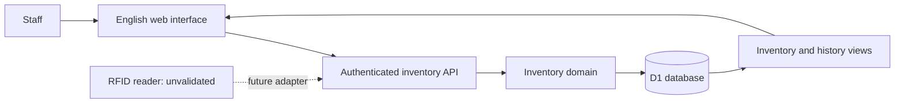

# Architecture and design decisions

## System boundary

The browser presents the staff review workflow. The authenticated API validates inputs, resolves identity server-side and performs prepared SQL against Cloudflare D1. Drizzle defines a versioned schema; runtime domain operations use the D1 API directly so their transactional boundary is explicit.

## Data model

| Table | Responsibility |
| --- | --- |
| people | Explicit native staff-account directory projections |
| buildings | Reference campus building codes and names; current write support is J18 |
| rooms | Number/name, parent building, placeholder and selectable flags |
| batteries | Asset identity, tag, specifications, owner and storage building with optional room |
| loans | Checkout, original holder snapshot/account ID, return and correction state |
| observations | Room, observation time, receipt time and source |
| charges | Historical completion time, duration in minutes and recorder; legacy percentage retained |
| audit_events | Who did what, when, and relevant before/after details |
| operations | Idempotency result and transaction guard |
| workspaces | One-time demo initialization marker |
| shared_inventories | Canonical scope for each shared working/demo dataset |
| staff_accounts | Login identity, role, access, profile, password hash and versions |
| staff_sessions | Hashed session tokens, account authorization version and expiry |
| staff_account_events | Immutable account-management and profile/password audit |
| sign_in_attempts | Failed sign-in window counters |

All business queries are scoped to the canonical inventory scope selected by dataset. Every active account resolves to the same working register and the same separate demonstration register. The server attaches the individual authenticated actor to writes. Staff directory rows project native accounts using explicit account IDs, unique per inventory; names never match identities. Missing reference buildings, placeholder rooms and account projections are inserted idempotently. Once complete, snapshot reads do not issue provisioning write batches. Current account names are joined for display without rewriting stored people versions or transaction snapshots.

Personal shortcuts narrow this shared register: My batteries compares ownerAccountId with the authenticated account; My loans compares the active borrower's account ID. They are presentation/query scopes, not private data stores or permissions. Everyone can return to the complete inventory.

Migration 0004 adds accounts and shared scope mapping without rebuilding existing business tables. On first use, a dataset with exactly one legacy inventory adopts its existing scope; keys, actor history and references stay intact. A fresh dataset receives a shared scope. Multiple legacy scopes return `legacy_inventory_review` and preserve all records until an explicit collision review and migration. This release does not claim to merge arbitrary private registers.

## Loan state

The database has a partial unique index allowing only one active loan for each battery. Confirmed checkout creates a loan for the authenticated staff member. The API rejects borrower/account/name substitutes, including administrator proxy requests. A missing linked directory row is created inside the same guarded checkout transaction with a deterministic account-derived ID. The loan stores the account ID and current saved account name; its original responsibility and checkout evidence cannot be rewritten. Confirmed return closes the exact reviewed loan and attributes receipt to the signed-in operator. Return review may contain batteries from different holders and original legacy borrowers.

A batch starts with an operations row whose CHECK constraint succeeds only if all expected loan states and authenticated permissions still hold. A return carries exact battery/loan ID pairs, not just battery IDs. Bound JSON sets avoid D1's per-statement parameter ceiling for the supported 100-battery batch without splitting its transaction. D1 batch applies the guard and every movement atomically. A conflict rolls back the complete batch. Request identifiers include the reviewed scope/state and permit safe retries after an interrupted response; reusing an identifier for a different action is rejected.

Only the most recent loan is eligible for correction. A mistaken active checkout is marked corrected; a mistaken return is reopened. The request freezes the intended correction action and reviewed return timestamp, and the commit guard checks both. A concurrent return cannot turn a void-checkout draft into a reopen-return action. The audit records the reason and pre-correction values. Existing transactions are not deleted.

Migration 0006 adds nullable people/loan account references and immutable association/evidence triggers without rebuilding tables or backfilling old borrowers. Old names, timestamps, actors, returns and corrected loans remain unchanged. Account disablement does not remove historical responsibility; other active staff can receive its return.

## Location and charging

Loan state is independent of observations. Latest location sorts by observation time, then receipt time and insertion order. Delayed older evidence cannot replace newer evidence. Observation time and source always travel with the room.

Storage uses a building plus an optional room. J18 Willis Annexe, E10 Hilmer Building and G17 Electrical Engineering Building are reference configuration, never evidence of physical presence. Only J18 is enabled for new battery and room registration/import. Demo room and Demo workspace are explicitly marked placeholders in both inventories; unknown assigned rooms can still be SQL NULL. Other building choices are disabled and room information is Not available. Rooms have stable IDs and numbers unique within their building. A selected room must be selectable and belong to the supported building and inventory. Renaming alone preserves its placeholder flag; verification is an explicit administrator action.

Migration 0007 adds constrained boolean room flags without rebuilding tables. It preserves existing identities, versions and evidence and accepts explicit placeholder labels in the existing observation-integrity guard. The local preview uses fresh disposable test business state; no compatibility-owner mapping field or legacy-borrower UI category was introduced.

New observations store the room number/name and building code/name when evidence is received. Both room and building versions, observation and audit event are checked and committed together. Later room or building edits do not change those stored labels. For a delayed observation, this snapshot does not reconstruct the room's name at an earlier observation time.

Older observations without saved labels retain their room ID and display that the original label is unavailable. The migration does not guess historical names. Location evidence is appended; existing observations cannot be rewritten.

New charge records pair a positive finite duration in minutes with completion time. Latest duration and time come from the same row, ordered by completion rather than receipt time. The software accepts durations up to 525,600 minutes as a data validation ceiling, not as a battery safety recommendation. Original percentages remain in legacy database/history records; they are no longer accepted in new charge submissions or displayed as charging information. Existing unknown durations remain NULL. Charge evidence is appended and cannot be rewritten. Sydney date entry is converted to UTC and rejects skipped/ambiguous daylight-saving times.

## Metadata and relationship integrity

Buildings, rooms and batteries have a version number. Their edits must submit the version loaded by the form. A stale edit returns HTTP 409 with `record_conflict`; it changes neither the record nor its audit history. A transaction guard verifies the version again when the write commits, so a change between validation and persistence is also rejected. Staff directory projections are read-only; staff identity and profile edits use the separate account-management workflow.

The form keeps the staff member's input after a conflict. Loading the latest record retains other users' changes to untouched fields and keeps the staff member's edited fields. If both changed the same field, the form shows the saved value alongside the current proposal. The staff member reviews and explicitly saves the result.

Versioned database triggers enforce record identity, version increments and same-inventory relationships even for direct SQL writes. A responsible battery owner must be a staff record and cannot be demoted while responsible for a battery. Battery storage rooms, loan borrowers, observations and charging records must belong to the same inventory as the battery. Future table rebuilds must recreate these trigger constraints.

Existing metadata and history identifiers cannot be inserted again through SQLite replacement or upsert statements. This prevents bypassing update guards and prevents a duplicate RFID identifier from deleting another battery. Metadata changes use ordinary versioned updates; observation evidence uses new identifiers.

Migrations 0001 and 0002 add integrity guards without rebuilding business tables. Migration 0003 adds buildings, room hierarchy and charging duration, and rebuilds batteries to allow an unknown room. It runs in one D1 transaction with deferred foreign-key validation; existing child references use NO ACTION, identities/versions and rows are copied, and every affected trigger/index is recreated before validation resumes. It does not disable foreign keys or edit earlier migrations. Migration tests retain old loans, observations, charging percentages and audit events and check for foreign-key violations. See [Cloudflare D1's foreign-key guidance](https://developers.cloudflare.com/d1/sql-api/foreign-keys/) and [SQLite's table-change procedure](https://www.sqlite.org/lang_altertable.html). Constraint failures use SQLite's [trigger error mechanism](https://www.sqlite.org/lang_createtrigger.html).

## Usability decisions

- The checkout holder is the signed-in staff member and needs no entry.
- Selected batteries appear first; optional search/manual tag lookup adds already registered batteries.
- The independent return shortcut starts with the current staff member's loans and can show all holders; explicit row selections are retained.
- Unknown or duplicate tag identifiers produce visible messages before confirmation.
- Searchable registered records reduce typing; CSV import supports initial setup.
- Invalid input remains in the form for correction.
- If a write succeeds but the following refresh fails, the message says the write succeeded and requests a refresh.
- Base UI combobox popups render inside the form's container to cooperate with Radix dialog focus/dismissal.
- Browser tools can read inventory or stage a review. They cannot commit a loan; a staff member confirms through the visible interface.

## Access and operational limits

Native application accounts are required for this release. Administrators create accounts; public sign-up and implicit first-visitor administration are absent. The initial administrator requires an installation setup secret and a newly chosen password. A local launcher generates an ignored development setup key; no production password or key is embedded in source.

Passwords use independently salted PBKDF2-SHA-256 with 600,000 iterations. The installed local Worker runtime was checked with this setting; any future deployment needs runtime and security review. The choice follows [OWASP password-storage guidance](https://cheatsheetseries.owasp.org/cheatsheets/Password_Storage_Cheat_Sheet.html). Only hashed random session tokens are stored in D1. Cookies use HttpOnly, SameSite=Strict, an eight-hour lifetime and Secure on HTTPS. Native session checks reject expired, disabled or superseded authorization versions on every API request. Password changes/reset, disabling and role changes revoke previous sessions. Failed sign-ins are throttled per username after ten failures in a fifteen-minute window; this is not a claim of comprehensive attack protection.

Server role checks distinguish registration from editing. Staff may read/export all business records, create batteries and confirm checkout/return. Administrator maintenance includes saved metadata, buildings/rooms, charge/demo-observation evidence, reasoned history corrections and account management. The staff directory is read-only; editable standalone people registration/import is disabled. New battery owners must be active native staff accounts, rechecked at commit alongside the actor's active state, authorization version and role. Own-profile operations cannot change role/access or another person's account. Account lists/audit are administrator-only. Permission checks are independent of hidden buttons.

Account edits use an expected version and atomic audit guard. Direct database triggers prevent deletion/replacement of account identities, account-audit rewrites and removal of the last active administrator. Disabled identities remain for attribution. Inventory history uses stable actor IDs and the name recorded at the time; later profile edits do not rewrite events.

API writes validate origin, JSON content and request size. SQL parameters are bound. Downloads require native sessions and return no-store HTTP attachments; credentials and session rows are not exported. The old hosting contract remains isolated in `lib/platform/auth-contract.ts`, preserving external protocol identifiers. Its headers and old mock cookie no longer grant access, and mock authentication is disabled in local Vite configuration.

## Shared refresh and exports

Snapshots read their related view tables in one D1 batch. Each server-generated export similarly reads inventory, complete evidence tables and directories together. A single Filter panel and the three status tabs use one shared schema/query for counts, pages and exports, with explicit unknown handling. Applied filters exposes active conditions above results. Chemistry/model values come from saved records; current-holder filters use account IDs. Timestamp ranges compare Sydney calendar dates; manufacture age uses one captured calculation date shared by filtering and exported age fields. Summary and detail scopes cover captured selected IDs, all matching batteries or the requested page; details also cover one ID. Nine section checkboxes determine included fields and history tables. All relevant stored history columns are retained. Credentials and sessions are excluded.

For personal exports, the viewer account comes from authenticated server context. Client-supplied viewer IDs cannot alter it. Explicit selected IDs ignore ordinary filters and pagination but must remain in the current fixed personal base. A return or owner reassignment that moves any selected battery outside that base produces HTTP 409 for the whole export; the UI retains selection with a warning and asks for explicit removal. Directory-list exports include native staff projections; detailed related-directory evidence remains complete for the requested records.

Detail screens show at most 200 recent entries per section for readability. Export reads have no such limit. Excel contains separate tables/worksheets and metadata; JSON preserves table structure. CSV supports flat reports and is rejected for detailed requests that would otherwise lose tables. CSV formula-like text is neutralized. Long Excel text is losslessly split into numbered parts in a Complete text worksheet. Worksheet row-limit overflow produces an explicit error and a JSON alternative.

Downloads are generated on the server and delivered as HTTP attachments. A preparation POST validates the selection; the subsequent attachment GET performs its own consistent read. The screen/preparation counts can differ from the file if another staff member changes inventory meanwhile. Export metadata records the generated scope, counts, selected sections and UTC time; it does not claim a frozen snapshot of the earlier screen.

The visible idle interface polls every ten seconds and on focus. Polling pauses around inventory draft dialogs, and changed data cannot silently discard selection or advance a form's loaded version. Stale requests cannot replace a newer loaded dataset. Personal profile conflicts preserve edited fields for a reviewed reload. This is eventual interface refresh; server state and conflict checks apply when each request commits.

## Operational release limits

Institutional identity/hosting approval, UNSW SSO, backup/restore and retention policy, large-load capacity and administrative tamper protection are not delivered by this prototype. Audit history is application-preserved, not a cryptographically immutable compliance ledger. Two-account shared behavior and contested D1 transactions have been tested; no departmental-scale traffic study or stakeholder efficiency experiment has been performed. This release stays local; old hosted environments were not updated.

## Visual reference

The design uses the public [UNSW JAGGAER quick reference guides](https://www.unsw.edu.au/assurance-integrity/safety/systems/Jaggaer/qrg), especially [Container Operations](https://www.unsw.edu.au/content/dam/pdfs/planning-assurance/safety/jaggaer/7-Container-Operations.pdf). The reference supplies visual conventions; it does not establish an integration contract. The live protected JAGGAER application was not accessed.
