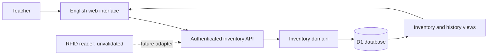

# Architecture and design decisions

## System boundary

The browser presents the teacher's review workflow. The authenticated API validates inputs, resolves identity server-side and performs prepared SQL against Cloudflare D1. Drizzle defines a versioned schema; runtime domain operations use the D1 API directly so their transactional boundary is explicit.

## Data model

| Table | Responsibility |
| --- | --- |
| people | Staff owners and borrower records |
| buildings | Selectable campus building codes and names |
| rooms | Number/name and parent building; old unreviewed building text retained separately |
| batteries | Asset identity, tag, specifications, owner and storage building with optional room |
| loans | Checkout, borrower snapshot, return and correction state |
| observations | Room, observation time, receipt time and source |
| charges | Historical completion time, duration in minutes and recorder; legacy percentage retained |
| audit_events | Who did what, when, and relevant before/after details |
| operations | Idempotency result and transaction guard |
| workspaces | One-time demo initialization marker |

All queries are scoped to the server-provided operator ID and dataset. Demonstration and working inventories cannot mix. This is an individual private prototype: sharing the Site does not create a shared departmental inventory.

## Loan state

The database has a partial unique index allowing only one active loan for each battery. Confirmed checkout creates a loan. Confirmed return closes it. Both retain audit events. Return review may contain batteries from different borrowers.

A batch starts with an operations row whose CHECK constraint succeeds only if all expected loan states still hold. D1 batch applies that row and every movement atomically. A conflict rolls back the complete batch. Request identifiers permit safe retries after an interrupted response; reusing an identifier for a different action is rejected.

Only the most recent loan is eligible for correction. A mistaken active checkout is marked corrected; a mistaken return is reopened. The audit records the reason and pre-correction values. Existing transactions are not deleted.

## Location and charging

Loan state is independent of observations. Latest location sorts by observation time, then receipt time and insertion order. Delayed older evidence cannot replace newer evidence. Observation time and source always travel with the room.

Storage uses a building plus an optional room. J18 is initial reference configuration, never evidence of a battery's physical presence. Working inventories have no seeded rooms. New registration requires a building; an unknown room is SQL NULL, with no fabricated placeholder room. Rooms have stable IDs and numbers unique within their building. A selected room must belong to the selected building and inventory. Moving a room across buildings is blocked while batteries explicitly registered to the old building reference it; reassign those batteries first. Legacy unverified room/building labels are retained and reviewed explicitly rather than inferred from names.

New observations store the room number/name and building code/name when evidence is received. Both room and building versions, observation and audit event are checked and committed together. Later room or building edits do not change those stored labels. For a delayed observation, this snapshot does not reconstruct the room's name at an earlier observation time.

Older observations without saved labels retain their room ID and display that the original label is unavailable. The migration does not guess historical names. Location evidence is appended; existing observations cannot be rewritten.

New charge records pair a positive finite duration in minutes with completion time. Latest duration and time come from the same row, ordered by completion rather than receipt time. The software accepts durations up to 525,600 minutes as a data validation ceiling, not as a battery safety recommendation. Original percentages remain in legacy database/history records; they are no longer accepted in new charge submissions or displayed as charging information. Existing unknown durations remain NULL. Charge evidence is appended and cannot be rewritten. Sydney date entry is converted to UTC and rejects skipped/ambiguous daylight-saving times.

## Metadata and relationship integrity

People, buildings, rooms and batteries have a version number. Edits must submit the version loaded by the form. A stale edit returns HTTP 409 with `record_conflict`; it changes neither the record nor its audit history. A transaction guard verifies the version again when the write commits, so a change between validation and persistence is also rejected.

The form keeps the teacher's input after a conflict. Loading the latest record retains other users' changes to untouched fields and keeps the teacher's edited fields. If both changed the same field, the form shows the saved value alongside the current proposal. The teacher reviews and explicitly saves the result.

Versioned database triggers enforce record identity, version increments and same-inventory relationships even for direct SQL writes. A responsible battery owner must be a staff record and cannot be demoted while responsible for a battery. Battery storage rooms, loan borrowers, observations and charging records must belong to the same inventory as the battery. Future table rebuilds must recreate these trigger constraints.

Existing metadata and history identifiers cannot be inserted again through SQLite replacement or upsert statements. This prevents bypassing update guards and prevents a duplicate RFID identifier from deleting another battery. Metadata changes use ordinary versioned updates; observation evidence uses new identifiers.

Migrations 0001 and 0002 add integrity guards without rebuilding business tables. Migration 0003 adds buildings, room hierarchy and charging duration, and rebuilds batteries to allow an unknown room. It runs in one D1 transaction with deferred foreign-key validation; existing child references use NO ACTION, identities/versions and rows are copied, and every affected trigger/index is recreated before validation resumes. It does not disable foreign keys or edit earlier migrations. Migration tests retain old loans, observations, charging percentages and audit events and check for foreign-key violations. See [Cloudflare D1's foreign-key guidance](https://developers.cloudflare.com/d1/sql-api/foreign-keys/) and [SQLite's table-change procedure](https://www.sqlite.org/lang_altertable.html). Constraint failures use SQLite's [trigger error mechanism](https://www.sqlite.org/lang_createtrigger.html).

## Usability decisions

- A teacher selects the borrower once for a batch.
- Unknown or duplicate tag identifiers produce visible messages before confirmation.
- Searchable registered records reduce typing; CSV import supports initial setup.
- Invalid input remains in the form for correction.
- If a write succeeds but the following refresh fails, the message says the write succeeded and requests a refresh.
- Base UI combobox popups render inside the form's container to cooperate with Radix dialog focus/dismissal.
- Browser tools can read inventory or stage a review. They cannot commit a loan; the teacher confirms through the visible interface.

## Access and operational limits

Authentication is supplied by the hosting platform. Application code uses the provider-neutral helpers in `lib/auth.ts`; exact external header and route identifiers are isolated in `lib/platform/auth-contract.ts`. Those identifiers are required by the current hosting service and cannot be renamed as application branding. Local mock authentication uses the fictional account **admin**, is limited to loopback development and is not bundled for production. API writes validate origin and JSON content; SQL parameters are bound.

Institutional access approval, shared roles, authentication through UNSW, backup/restore policy, retention and administrative tamper protection are not delivered in this prototype. Audit history is application-preserved, not a cryptographically immutable compliance ledger.

## Visual reference

The design uses the public [UNSW JAGGAER quick reference guides](https://www.unsw.edu.au/assurance-integrity/safety/systems/Jaggaer/qrg), especially [Container Operations](https://www.unsw.edu.au/content/dam/pdfs/planning-assurance/safety/jaggaer/7-Container-Operations.pdf). The reference supplies visual conventions; it does not establish an integration contract. The live protected JAGGAER application was not accessed.
