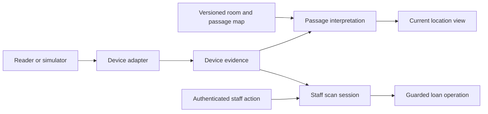

# RFID data and validation plan

Draft for review, 2 October 2026. This document specifies a proposed device interface and validation approach. It does not implement RFID ingestion, certify a device, or report measured performance.

The related local software phase now implements staff-operated manual/simulated scan sessions with continuous processing or reviewed batches, guarded tag/version/loan bindings and optional dated return confirmation. It uses existing inventory operations and labels demonstration input explicitly. The normalized device-event example and hardware interpretation below remain proposed contracts; no real-reader parser, unattended read stream or automatic room decision has been implemented. Actual local software outcomes are recorded separately in [validation.md](validation.md).

## Scope and recommendation

The planned deployment has at least 200 batteries across two floors. Each floor has one large laboratory and two storage rooms, giving six monitored rooms. Room dimensions, door connections, cabinet materials, tag models and reader models remain unknown. Floor and room names used in future fixtures must be labelled as demonstrations until real directory records are confirmed.

The intended service is staff-operated checkout and return plus room-level location evidence. Outside those rooms, no detailed tracking is required. Passage-based tracking is a candidate for reducing interior coverage, subject to doorway tests and coverage of every relevant route. A missed transition can leave the last recorded room wrong, so uncertainty and reconciliation remain necessary.

Use tags for identity, the database for battery information, and separate records for what a reader reported and what the system inferred. Borrowing, registered storage and observed location remain independent.

## What tags can store

UHF Gen2 defines four logical memory banks. Implemented capacities and access features depend on the chip. The [GS1 Gen2 specification, section 6.3.2.1](https://ref.gs1.org/standards/gen2/2.1.0/) is the source for this memory organization, rather than a promise about an unselected product.

| Memory | Purpose | Proposed project use |
| --- | --- | --- |
| EPC | Object identification plus protocol information | Read the enrolled identifier and resolve it to a battery |
| TID | Chip identification, with a serial number on chips that provide one | Optional additional identity evidence; verify the selected chip's format and serialization |
| User | Optional application data | Not required for the first release |
| Reserved | Access and kill passwords where implemented | Device provisioning only; never a place for application login credentials |

Capacity is measured in bits, not characters. For example, Impinj documents a 128-bit EPC area for M730 and a 96-bit EPC area plus 32-bit user memory for M750. These are examples, not selected hardware; 96 bits equals 12 bytes, and 32 bits equals 4 bytes. See the [manufacturer's memory description](https://www.impinj.com/about-us/news-room/2019/impinj-introduces-two-new-rain-rfid-tag-chips-for).

The recommended first-release policy is to retain or provision a unique EPC and bind it to a stable battery ID. Store specifications, responsible owner, current borrower, registered storage, location evidence and charging history in the database. Do not rewrite the tag after every loan or movement. A compatible reader can access implemented memory when the tag's access settings permit; user memory and TID need not be returned in every inventory report.

An identifier alone is not authentication. Do not assume arbitrary tags have unique factory EPCs or globally serialized TIDs. During enrollment, check duplicates, read back any written identifier, and record the binding. Tag replacement closes the old binding and creates a new one without changing the battery identity. Avoid reusing old identifiers in the first release. Final encoding and write-protection settings remain a provisioning decision after the chip and any integration requirements are known.

Ordinary identification tags do not measure the battery's charge, temperature or condition. Sensor tags would be separate hardware outside this plan.

## What a reader can report

A reader observes a radio response. It does not directly know the battery owner, loan intent, room name or current charge. Device IDs, timestamps and radio measurements are supplied by the reader or collector; rooms are resolved through installation configuration; borrowing comes from an authenticated staff transaction.

| Information | Interface policy |
| --- | --- |
| EPC or other explicitly supported identity format | Required for resolving a read; retain the raw representation |
| Reader and antenna or read-point identity | Required for multi-room interpretation; a single-port device may use an explicitly configured read point |
| Observation time | Prefer a verified device timestamp; otherwise record collector time and its limitation |
| RSSI, read count, phase or channel | Optional, with documented units and meaning; absent values stay null |
| TID or user memory | Optional, only when supported and requested |
| Native passage events | Optional device capability requiring validation; not a universal reader output |

The [Zebra connector format example](https://zebradevs.github.io/rfid-ziotc-docs/migration/FxConnect/fxconnect.html) demonstrates EPC, antenna, timestamp, RSSI and other fields. It also shows that formats vary. A device adapter must translate actual output; software must not assume every reader exposes that example format.

RSSI is signal strength, not a measured distance or proof of a room. Read count is the count represented by one report, not the number of batteries or passages.

## Doorway feasibility

An entrance detector must identify both the battery and its transition between known sides. Candidates include a supported directional reader or multiple read zones with an independently validated detection rule and, where useful, passage sensors. Installing two antennas does not itself establish a reliable direction algorithm. A person sensor alone also cannot establish which battery moved when several tags are nearby.

For example, [Zebra's directionality documentation](https://zebradevs.github.io/rfid-ziotc-docs/directionality/index.html) distinguishes NEW, TRANSITION and TIMED_OUT events and limits that documented mode to a specified reader family. TIMED_OUT represents a reporting timeout, not proof of crossing a room boundary. The [Impinj configuration guide](https://support.impinj.com/hc/en-us/articles/32153110595219-Impinj-IoT-Device-Interface-API-Example-Inventory-Configurations) also calls for application-specific tuning to reduce stray reads.

Feasibility is conditional on tag readability, actual door geometry, all relevant routes being observed, tolerable missed or ambiguous events, and recovery after an observation gap. Technical documentation establishes that directional products exist; it does not establish performance for these batteries or this building.

An exit from a storage room into a laboratory remains inside the monitored rooms. An exit into an unmonitored corridor may support an outside-room state. Outside means outside the six monitored rooms, not outdoors, outside the building or lost. Unknown connections must not be filled with assumed destinations.

## Proposed data records

These are logical responsibilities, not a committed SQL migration or a requirement for separate infrastructure services.

| Record group | Core information | Rule |
| --- | --- | --- |
| Battery and tag bindings | Battery ID, identity type/value, optional TID, valid-from/to, actor and reason | Keep battery identity stable through tag replacement |
| Installation configuration | Existing room IDs, floor metadata, passage ID, its two endpoints, reader/read-point IDs, capabilities, effective dates and version | Preserve the configuration used to interpret old evidence |
| Device evidence | Stable event ID, raw identity, source, device/read point, times, optional radio data, payload reference | Preserve what was actually reported, including unknown tags |
| Passage decisions | Decision ID, tag binding, passage, from/to endpoints, occurrence time, accepted/ambiguous/rejected, evidence IDs and rule version | An accepted decision is still an inference under a tested rule |
| Current location view | In-room/outside-monitored/unknown, nullable room ID, evidence time, source decision, freshness and reason | Rebuildable view, never the only history |
| Device health | Device, connection state, last heartbeat, clock status, known observation gaps | A failure changes confidence or freshness, not physical location |
| Scan sessions | Session, authenticated staff, checkout/return mode, selected batteries or exact loan pairs, request ID and result | Reuse the existing guarded loan operations |

Use strings for tag values, preserve leading zeros and original length, and normalize documented encodings without truncation. A hex EPC and a decoded display label are not interchangeable identifiers. No permanent tag encoding or maximum length is selected in this draft.

The service resolves inventory scope and device identity from enrolled credentials and server configuration, not simply from caller-supplied room or account names. Hardware and simulated sources must remain separate. Unknown or conflicting tag bindings create a review item, not a new battery or automatic loan.

## Proposed normalized event

This is an illustrative stored record for a simulator, not an actual reader payload or production identifier encoding. The collector creates its event ID before durable queueing; the server supplies receivedAt. The example EPC is an arbitrary hexadecimal fixture, not a claim of GS1 identifier allocation.

```json
{
  "schemaVersion": 1,
  "eventId": "sim-read-0001",
  "eventType": "tag_read",
  "dataOrigin": "simulated",
  "readerId": "sim-reader-1",
  "readPointId": "sim-reader-1-port-1",
  "epcHex": "D00100000000000000000001",
  "tidHex": null,
  "observedAt": "2026-10-02T04:32:10.120Z",
  "capturedAt": "2026-10-02T04:32:10.150Z",
  "receivedAt": "2026-10-02T04:32:10.300Z",
  "timeSource": "simulator",
  "clockStatus": "simulated",
  "rssiDbm": -57,
  "readCount": 1,
  "mappingVersion": "sim-map-1",
  "rawPayloadRef": null
}
```

Hardware records use a verified hardware source. If a reliable observation time is absent, observedAt is null and collector capture time is retained as collection evidence. Do not invent device precision. Store timestamps in UTC and present them in Australia/Sydney. Optional vendor event IDs, boot/session IDs, sequence numbers, phase and frequency can be added through the versioned adapter contract.

Room names do not belong in a raw read as authoritative location. The server resolves the read point against the configuration effective at the event time, where that time is trustworthy. An event spanning an uncertain mapping change remains unresolved. Preserve resolved room label snapshots for historical display.

Native directional events must retain their original event type and payload reference, then pass through the same configuration and evidence checks. They must not be falsely presented as a pair of raw antenna reads.

## Event and state rules



- A retry reuses the event ID and cannot create another passage or transaction. A genuinely new read has a different ID even if its EPC is identical. Stable vendor sequencing may assist deduplication; EPC alone is never a deduplication key.
- Preserve raw vendor reports separately from their interpretation. Short-window aggregation can reduce storage and UI noise, but its rule, counts and time span must be explicit. Raw diagnostic retention and archive volume are sized from observed traffic; no indefinite full-rate storage is promised.
- A delayed older event is saved as history. Arrival order alone cannot move a battery back to an earlier room. Ambiguous timestamps, sequence gaps and conflicting simultaneous evidence trigger reconciliation rather than an arbitrary winner.
- In-room, outside-monitored and unknown are explicit states. No-read timeouts never create an outside state. A trustworthy later observation can reconcile a gap; a manual correction preserves the previous evidence and its reason.
- A last accepted room and its time remain visible when current confidence is insufficient. Expiry and gap policies are configured after testing; an old entry is not presented as continuous live confirmation.
- Directional decisions need evidence and a rule version. Do not invent a numerical confidence percentage. Ambiguous crossings remain ambiguous.
- Raw reads and passage events cannot directly alter loans. A staff checkout binds the authenticated staff member under existing rules; a return targets the exact reviewed battery/loan pairs. A scan-session retry reuses the business request ID. Nearby staff tags are not an implicit authorization mechanism.
- A reboot or network outage must not turn queued observations into current measurements. Persist pending event IDs and track gaps; endpoint failure is visible to staff without declaring assets lost.

## Fit with the current application

Reuse the battery register, staff accounts, room directory, loan records, audit history and guarded request handling. The existing batteries.tagId is a single current identifier; a future migration should preserve it while introducing binding history and an explicit identity format. Do not reinterpret legacy text identifiers as valid hexadecimal EPCs without checking.

The current observations table requires a room for every observation. It cannot represent outside-monitored or unknown correctly. Add an explicit location evidence model through a versioned migration rather than creating artificial Outside or Unknown rooms. Existing observations and their source/time/label snapshots remain historical evidence. The final migration must preserve current same-inventory, identity and audit safeguards.

The current application requires reviewed staff loan operations. Automatic passage-triggered checkout is not delivered by this plan and would need a separate, explicit identity and transaction design. Real RFID ingestion stays disabled until the model, adapter output and installation mapping have been validated.

## Validation before and after device arrival

Before hardware arrives, prepare versioned example files and expected outcomes. These prove software handling only. Every example must be marked simulated and kept out of working hardware evidence.

| Example | Required software outcome |
| --- | --- |
| Validated simulated passage from storage to laboratory | Update the derived room; no loan change |
| Validated simulated passage out of monitored rooms | Outside state with evidence time and source |
| Timeout without a passage | No invented exit; preserve last evidence and show uncertainty as appropriate |
| Duplicate delivery | One accepted event/decision/operation |
| Later arrival of an older event | Preserve history without blindly replacing the current room |
| Device restart, bad clock or observation gap | Expose limited evidence and reconcile; do not fabricate a route |
| Two rooms claim the same tag | Show conflict, not a forced strongest-signal winner |
| Unknown, duplicate or retired tag | Flag identity resolution; no unintended battery or loan change |
| Tag replacement followed by delayed reads | Resolve through binding history; preserve the original asset history |
| Room or antenna mapping changes | Interpret with the applicable version or leave unresolved |
| Checkout and return scan sessions | Preserve identity, exact loan selection, retry and concurrency safeguards |

After hardware arrives, first capture real payloads, supported fields, units and clock behavior. Test actual tags on representative batteries before installing a full site. At one proposed doorway, label ground truth independently and repeat both directions, stops, reversals, walk-bys, nearby stationary batteries, typical and maximum intended carrying batches, body shielding and relevant containers. Include neighboring rooms and the other floor. Test network loss and reader restart, not only ideal crossings.

Measure per-tag read recall, missed passages, wrong directions, false passages from stationary/walk-by tags, ambiguous decisions and update latency. Report ambiguity separately rather than hiding it inside successful detections. Lock the acceptance thresholds and test protocol before the held-out validation run; the required operating batch size, time tolerance and thresholds remain unagreed. There is no measured accuracy claim in this document.

Run a shadow trial alongside a checked manual record before using derived location operationally. Reconcile the full population, including actual dense storage. If reliable transitions require extra user actions that outweigh the benefit, retain staff scanning and dated location evidence rather than adding an unreliable automatic workflow.

## Information to obtain from the supplier

Request the exact Australian reader SKU and firmware, tag/chip and attachment specification, memory map, EPC provisioning method, supported antenna/read-point reports, real payload samples, documented timestamp/units, directional capabilities and limitations, API/SDK and licence terms, and outage/replay behavior. Obtain the room connection diagram and storage conditions from the site. None of these unknowns is replaced by the simulator contract.

At this stage we can finalize terminology, evidence separation, placeholder fixtures and expected software behavior. Device parsing, tag selection, antenna placement, timing thresholds, deployment cost and proof that doorway detection meets requirements remain open until real evidence is available.
